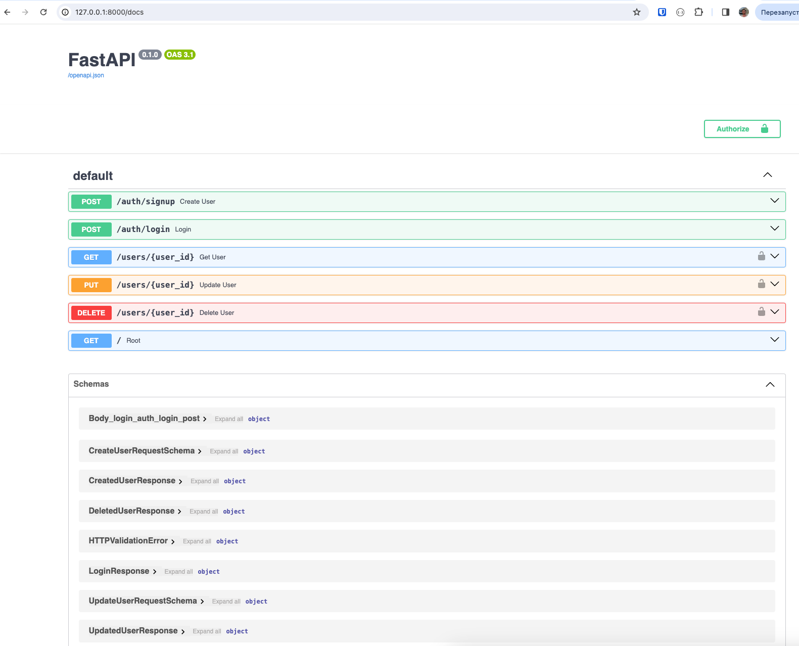

# Entities

This repository hosts an asynchronous REST API built using FastAPI. The API implements CRUD (Create, Read, Update, Delete) operations on entities in an efficient and non-blocking manner.

### Setup
To install and run the app follow these steps:
1. Clone the repo: `git clone https://github.com/alexfurmenkov/fast-api-async-entities-manager.git`
2. Create Python virtual environment: `python3 -m venv venv`
3. Activate Python virtual environment: `source venv/bin/activate`
4. Install the required dependencies: `pip install -r requirements.txt`
5. Start a PostgreSQL DB locally and export its URL: `export DATABASE_URL=...`
6. Run DB migrations with Alembic: `alembic upgrade head`
7. Export a JWT secret: `export JWT_SECRET_KEY=mysecret` 
8. Run the app: `uvicorn app:app --reload`. It will start the app on port 8000.

### API Documentation
After the app is launched, navigate to `/docs` URI to explore the interactive Swagger documentation:

### K8S Deployment
The project contains K8S manifest files making it deployable to a K8S cluster. Follow these steps to spin up a Minikube cluster locally and deploy this app into this cluster.
1. Install and start the Minikube cluster - https://minikube.sigs.k8s.io/docs/start/
2. Create secrets: `kubectl apply -f k8s/secrets`
3. Deploy Postgres: `kubectl apply -f k8s/postgres-deployment.yml && kubectl apply -f k8s/postgres-service.yml`
4. Deploy the app itself: `kubectl apply -f k8s/app-deployment.yml && kubectl apply -f k8s/app-service.yml`
5. Enable ingress addons in minikube: `minikube addons enable ingress && minikube addons enable ingress-dns`
6. Deploy the Nginx ingress controller: `kubectl apply -f https://raw.githubusercontent.com/kubernetes/ingress-nginx/controller-v1.0.0/deploy/static/provider/cloud/deploy.yaml`
7. Deploy the ingress: `kubectl apply -f k8s/ingress.yml`
8. (for Mac users) The ingress file makes the app available at `myapp.example.com` host. You need to edit `/etc/hosts` file and map `127.0.0.1` to `myapp.example.com`. Just add a new row like `127.0.0.1       myapp.example.com`.
9. (for Mac users) Run `minikube tunnel` and open `myapp.example.com` in the browser. You should see the app homepage.